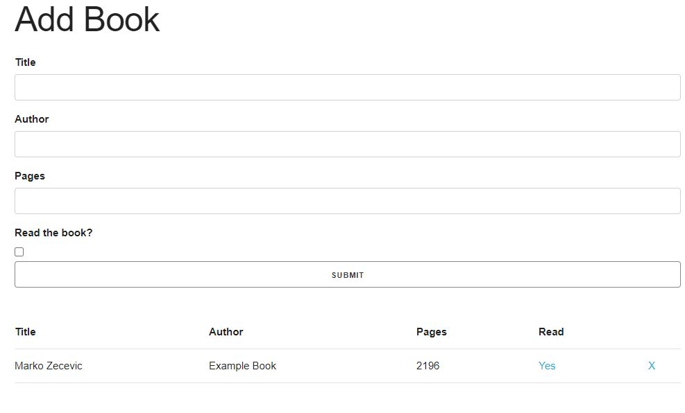

## Library Project- JavaScript

> This is part of the Library Project in [The Odin Project's](https://www.theodinproject.com/courses/javascript/lessons/library) JavaScript Curriculum.

> In this project you can add books to library, delete them or change their read status.

## Built With

- JavaScript, HTML5 and Skeleton CSS

## Screenshot

## Getting Started

To get a local copy up and running follow these simple example steps.

- git clone `https://github.com/MarkoNS1990/library`
- cd into the `library`
- open `index.html`

### Prerequisites

- Get a browser like Chrome and Firefox in their most recent versions

### Install

- Install VSCode or any code editor you prefer

### Live demo
https://markons1990.github.io/library/

# Author

👤 **Marko Zecevic**

## 🤝 Contributing

Contributions, issues and feature requests are welcome!

Feel free to check the [issues page](https://github.com/iliebabcenco/library-project/issues).

## Acknowledgments

[The Odin Project](https://www.theodinproject.com)
[Microverse](https://www.microverse.org)

## Show your support

Give a ⭐️ if you like this project!
